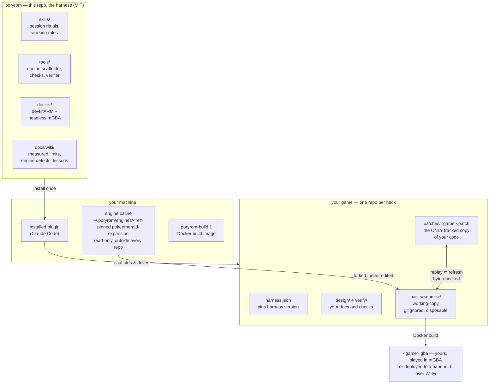
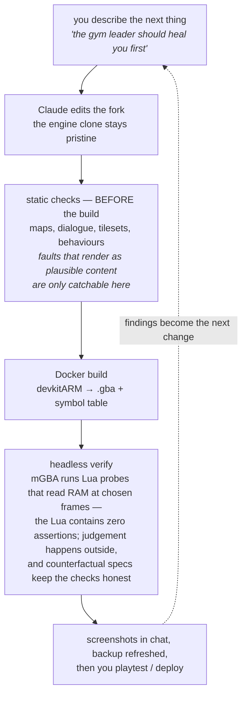

# poryrom

**An expert workbench for building Pokémon ROM hacks — specifically hacks of Pokémon Emerald,
via [pokeemerald-expansion](https://github.com/rh-hideout/pokeemerald-expansion) — installed as
a Claude Code plugin.**

You describe your game in plain English. The workbench scaffolds it into its own repo, edits a
fork of the engine, builds it in Docker, **proves the change worked by reading the running
game's memory in a headless emulator**, puts screenshots in front of you before you playtest,
and deploys to a handheld. If you have ever wanted to make your own Emerald hack without
becoming a build-system archaeologist first, this is for you.

*Not affiliated with or endorsed by Nintendo, Game Freak, or The Pokémon Company. See
[Legal posture](#legal-posture).*

## How it fits together

Three separations carry the whole design. The **engine cache** is a pinned clone of the public
decompilation, shared by every game, never edited, and never inside any repo. Your **game repo**
tracks only what is yours — design, checks, and a patch that replays byte-for-byte onto the
pinned engine. The **working copy** where edits actually happen is disposable and gitignored,
rebuilt from the patch on any machine with one command.

## What a change looks like

Most ROM-hacking setups can build. This one can **prove**. Every claim of "it works" is a spec
file replayed in a headless emulator against named symbols in the game's own memory — and each
spec has a counterfactual twin pointed at an unpatched ROM, expected to fail, so a check that
passes for the wrong reason gets caught.

## What's in the box

| | |
|---|---|
| `skills/` | the working rules Claude loads — voice, measured walls, session ritual, build ritual |
| `tools/` | the Python: `doctor.py` (can this machine build?), `new_game.py` (scaffold a hack), `restore_hack.py` (rebuild the working copy from a patch), `verify_hack.py` (prove a change), map/dialogue/tileset checkers, sprite and audio pipelines, handheld deploy |
| `harness/` | the Lua the emulator runs — zero assertions, by design |
| `docker/` | the build image recipe, including three patches to headless mGBA |
| `verify/` | the harness's own checks; your game's checks live in your game's repo |
| `docs/wiki/` | the knowledge: years of measured engine limits (sprite palettes, map ceilings, audio voices, save sectors), each with *what hitting it looks like*, because thirteen of them fail silently |
| `templates/` | starter files a new game repo is scaffolded from |

## Setup on a machine that has nothing

1. **Install Docker Desktop** and start it — everything compiles inside a container.
2. **Install this plugin** in Claude Code, then ask it to *"check the setup"*. The doctor
   reports exactly what is missing and the one command that fixes each thing, including cloning
   the engine (~1 GB, from its own public repository).
3. **Ask to start a new game.** The scaffolder creates your game's repo with its design doc,
   verification folder, and pin file, and builds a first playable ROM.

You do not need to read any code to do any of this. Ask in plain English.

Also speaks the [Agent Plugins](https://agent-plugins.org) open standard — the root
`plugin.json` — so clients other than Claude Code can discover the plugin and its skills.

## Honest limits

- **Emerald only, deliberately.** The harness is expert in one engine — its symbol maps, its
  measured walls, its defects. Other decomps would need their own.
- **Savestate-based checks can't run on a fresh machine yet.** Savestates are never distributed,
  and regenerating one re-rolls the RNG; pinning the boot seed is the top of the roadmap.
- **Your games are yours to keep.** The workbench builds for personal play and will not help
  package or distribute a hack.

## Legal posture

This repository contains **only original tooling and documentation**, MIT-licensed. It contains
no Nintendo code or assets and no ROMs, and it never downloads any: it builds against the
community's public decompilation project, fetched from that project's own repository at setup
time into a cache outside every repo. Pokémon and Pokémon Emerald are trademarks of Nintendo /
Creatures Inc. / GAME FREAK inc.; this project is not affiliated with or endorsed by them.

## License

MIT — see [LICENSE](LICENSE). The mGBA patches under `docker/` modify MPL-2.0 code and carry
that license.
