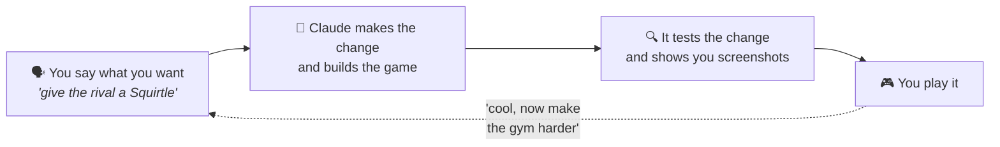

# poryrom

**Make your own Pokémon game by talking about it.**

poryrom turns Claude into the ROM-hacking expert you always wished you had. You describe your
game in plain English — *"I want a region based on the Pacific Northwest"*, *"make the third
gym leader use only fossil Pokémon"* — and it does the rest: writes the code, builds the game,
tests that your change actually works, and shows you screenshots before you even boot it up.

It builds hacks of **Pokémon Emerald**, using
[pokeemerald-expansion](https://github.com/rh-hideout/pokeemerald-expansion) — the community
project that rebuilt Emerald's source code and modernized it with mechanics from the newer
generations. You don't need to know what any of that means to use this.

*Not affiliated with or endorsed by Nintendo, Game Freak, or The Pokémon Company.*

## How it works

That's the whole loop. A few things happen behind the curtain that make this different from
just asking an AI to write game code:

- **It knows this engine cold.** Years of measured knowledge is built in — how big a map can
  be, how many sprites fit, which mistakes fail silently — so it warns you *before* your idea
  hits a wall, not after.
- **It proves changes instead of assuming them.** Every change gets tested by actually running
  your game in an emulator and checking the game's own memory. "It should work" becomes "here's
  the evidence it works."
- **Your work is always safe.** Your game lives in its own folder with its own history, backed
  up in a form that can rebuild the whole project on any computer.
- **No searching around.** No wikis to trawl, no forum threads from 2011, no tool chains to
  assemble. You ask, in the same chat you already use.

## Getting started

You need three things: [Claude Code](https://claude.com/claude-code) (the app this plugs into),
[Docker Desktop](https://www.docker.com/products/docker-desktop/) (the game compiles inside it
— install it, start it, forget it), and about 2 GB of free disk space.

1. **Install the plugin** in Claude Code.
2. **Say "check my setup."** It will tell you exactly what's missing and give you the one
   command that fixes each thing. There's a one-time download of the game engine (about 1 GB).
3. **Say "start a new game" and describe your idea.** You'll get your own project folder and a
   playable game file to open in any GBA emulator ([mGBA](https://mgba.io) is the usual choice).

From then on, it's a conversation. Some things people say:

> "Add a rival who picks the type that beats mine."
> "Make surfing available before the third gym."
> "Design a new Pokémon — an electric sheep — and put it on Route 2."
> "The cave music is too gloomy. Something more mysterious."
> "Put my game on my handheld."

## Good to know

- **Your game is for you.** poryrom builds games for personal play — it won't help package or
  distribute them, and nothing Nintendo-owned is ever included in this project or your game
  folder. The engine it builds on is downloaded from that community project's own public page.
- **Emerald only, on purpose.** Being an expert in one engine is the whole point.
- **It's honest about limits.** Some of its self-tests only run on the machine where a game was
  first created — the README-level version of that story is: it will tell you, not pretend.

## Want the deep end?

The technical story — what's actually in this repo, how verification works, the two detailed
architecture diagrams — lives in [docs/architecture.md](docs/architecture.md). The knowledge
base itself is in [docs/](docs/README.md): 17 pages covering everything from *what makes a hack
good* ([design-craft](docs/wiki/design-craft.md) — start there) to the exact bytes of a Pokémon.

## Legal

This repository contains only original tooling and documentation, MIT-licensed — see
[LICENSE](LICENSE). It contains no Nintendo code or assets and no ROMs. Pokémon and Pokémon
Emerald are trademarks of Nintendo / Creatures Inc. / GAME FREAK inc.; this project is not
affiliated with or endorsed by them.
