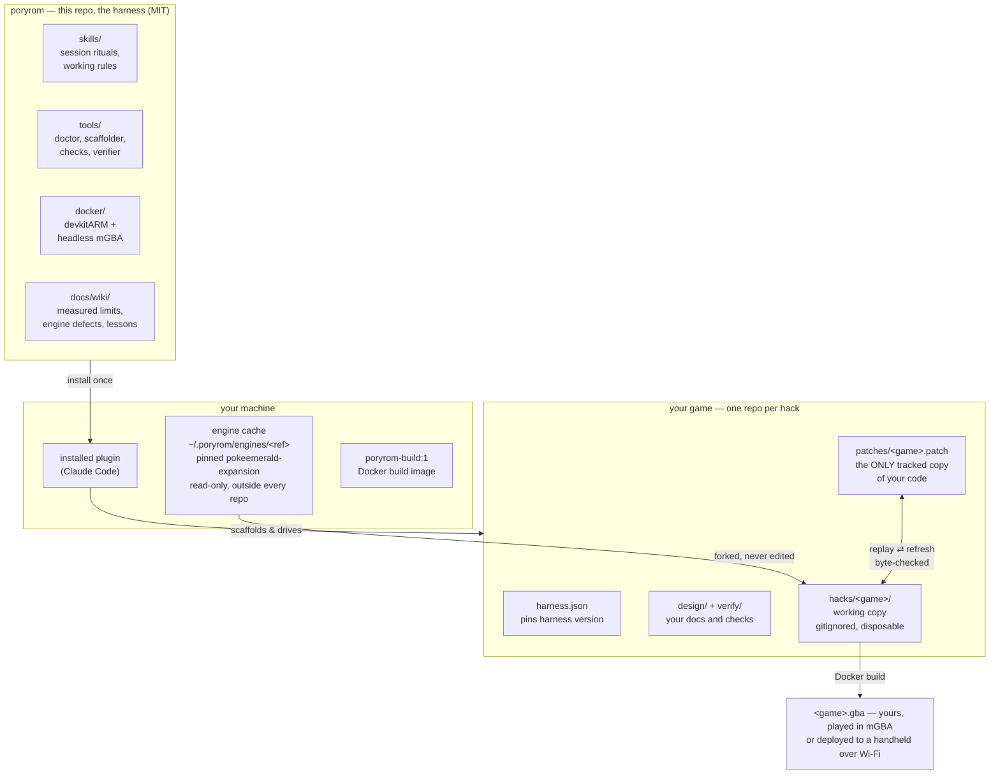
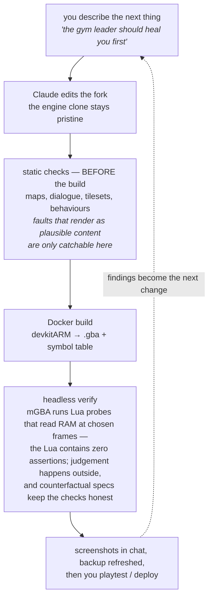

# Architecture — how poryrom actually works

This is the technical companion to the [README](../README.md). If you just want to make a game,
you never need this page.

## The three separations

Three separations carry the whole design. The **engine cache** is a pinned clone of the public
decompilation, shared by every game, never edited, and never inside any repo. Your **game repo**
tracks only what is yours — design, checks, and a patch that replays byte-for-byte onto the
pinned engine. The **working copy** where edits actually happen is disposable and gitignored,
rebuilt from the patch on any machine with one command.

## The verification loop

Most ROM-hacking setups can build. This one can **prove**. Every claim of "it works" is a spec
file replayed in a headless emulator against named symbols in the game's own memory — and each
spec has a counterfactual twin pointed at an unpatched ROM, expected to fail, so a check that
passes for the wrong reason gets caught.

## What's where

| | |
|---|---|
| `skills/` | the working rules Claude loads — voice, measured walls, session ritual, build ritual |
| `tools/` | the Python: `doctor.py` (can this machine build?), `new_game.py` (scaffold a hack), `restore_hack.py` (rebuild the working copy from a patch), `verify_hack.py` (prove a change), map/dialogue/tileset checkers, sprite and audio pipelines, handheld deploy |
| `harness/` | the Lua the emulator runs — zero assertions, by design |
| `docker/` | the build image recipe, including three patches to headless mGBA |
| `verify/` | the harness's own checks; your game's checks live in your game's repo |
| `docs/wiki/` | 17 pages of distilled knowledge — see [docs/README.md](README.md) for the map |
| `templates/` | starter files a new game repo is scaffolded from |

## Standards

Beyond being a Claude Code plugin, the repo carries a root `plugin.json` conforming to the
[Agent Plugins](https://agent-plugins.org) 1.0.0 open standard, so other compliant clients can
discover the plugin and its skills.
